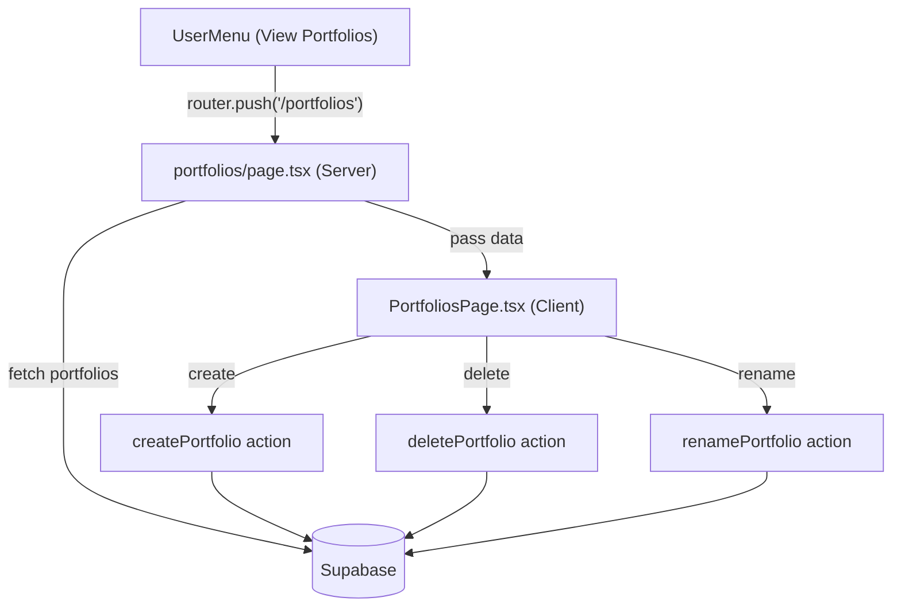

# Multiple Portfolios Integration

## Architecture Overview

## File Structure

New and modified files:

- `finance-dashboard/app/(main)/portfolios/page.tsx` -- Server component (auth + data fetch)
- `finance-dashboard/app/(main)/portfolios/PortfoliosPage.tsx` -- Client component (interactive UI)
- `finance-dashboard/app/(main)/portfolios/portfolios.module.css` -- Page-specific styles
- `finance-dashboard/app/(main)/actions/portfolio.ts` -- Server actions (create, delete, rename)
- `finance-dashboard/types/supabase.ts` -- Already updated by user (is_default added)
- `finance-dashboard/app/(main)/hooks/useNavigation.ts` -- Uncomment portfolios route
- `finance-dashboard/app/(main)/components/navbar/UserMenu.tsx` -- No changes needed (already has "View Portfolios")

## 1. Update Supabase Types (DONE)

Already completed by the user. The `is_default` column is now present in the `portfolios` Row, Insert, and Update types in [types/supabase.ts](finance-dashboard/types/supabase.ts).

## 2. Create Server Actions

New file: `app/(main)/actions/portfolio.ts` with `'use server'` directive.

Three actions following the `.cursorrules` standard response pattern `{ data: T | null, error: string | null }`:

- `**createPortfolio(name: string)**` -- Insert into `portfolios` with `user_id` and `is_default: false`, then `revalidatePath('/portfolios')`
- `**deletePortfolio(id: string)**` -- First check `is_default` is false (refuse to delete default), then delete from `portfolios` by `id` and `user_id`, then `revalidatePath`
- `**renamePortfolio(id: string, name: string)**` -- Update `name` on `portfolios` by `id` and `user_id`, then `revalidatePath`

All actions use `createClient` from `@/lib/supabase/server` and include try/catch with user-friendly error messages. All actions verify `user_id` ownership.

## 3. Create Portfolios Page (Server Component)

New file: `app/(main)/portfolios/page.tsx`

- Follows the same pattern as `portfolio/[id]/page.tsx` and `dashboard/page.tsx`
- Uses server-side `createClient` to authenticate and fetch all portfolios for the user: `.from('portfolios').select('id, name, is_default, created_at').eq('user_id', user.id).order('created_at')`
- Also fetches `portfolio_items` for each portfolio to compute total value as `SUM(buy_price * quantity)` using a second query with Supabase's relational select: `.from('portfolios').select('id, name, is_default, created_at, portfolio_items(buy_price, quantity)').eq('user_id', user.id).order('created_at')`
- Computes the value for each portfolio and passes the enriched list (with `totalValue` per portfolio) to the client component

## 4. Create PortfoliosPage Client Component

New file: `app/(main)/portfolios/PortfoliosPage.tsx`

Matches the screenshot design:

- Page header: "Your Portfolios" title + description text
- Portfolio list: each item shows the portfolio name, its total value (computed from `portfolio_items` as `SUM(buy_price * quantity)`), and action buttons (pencil for rename, trash for delete)
- Default portfolio: displays **(Default)** label next to the portfolio name; the delete button is **completely hidden** (not just disabled) for the default portfolio, making it intuitively clear it cannot be removed
- Non-default portfolios: show both pencil (rename) and trash (delete) action buttons
- "Create New Portfolio" button at the bottom (purple gradient, matching screenshot)
- Inline rename: clicking pencil toggles an input field for the name
- Delete confirmation: a simple confirm dialog before deleting
- Uses `lucide-react` icons (Pencil, Trash2, Plus) consistent with existing icon usage
- Calls server actions via form actions / direct invocation

## 5. Create CSS Module

New file: `app/(main)/portfolios/portfolios.module.css`

Following existing conventions from `navbar.module.css` and `auth.module.css`:

- camelCase class names
- Uses CSS custom properties (`var(--color-surface)`, `var(--color-card)`, etc.)
- Dark glassmorphism card style for portfolio items matching the screenshot aesthetic
- Responsive design with media queries

## 6. Wire Up Navigation

In [useNavigation.ts](finance-dashboard/app/(main)/hooks/useNavigation.ts): uncomment the switch statement and wire `'portfolios'` to `router.push('/portfolios')`. Also wire up the other existing targets that are currently commented out so the navigation hook is functional.

## Key Design Decisions

- **Default portfolio protection (dual-layer)**: Server-side -- the `deletePortfolio` action refuses if `is_default` is true. Client-side -- the delete button is entirely hidden for the default portfolio, and a "(Default)" label is shown next to the name to make it intuitively clear
- **No `is_default` on new portfolios**: All user-created portfolios are inserted with `is_default: false`
- **Cascade behavior (confirmed)**: The `portfolio_items` table has `ON DELETE CASCADE` on `portfolio_id` FK (verified from the DB schema screenshot), so deleting a portfolio automatically removes all its items -- no manual cleanup needed
- **Portfolio value calculation**: Computed server-side in `page.tsx` by fetching `portfolio_items` for each portfolio and summing `buy_price * quantity`. This gives the total cost-basis value displayed next to each portfolio name

