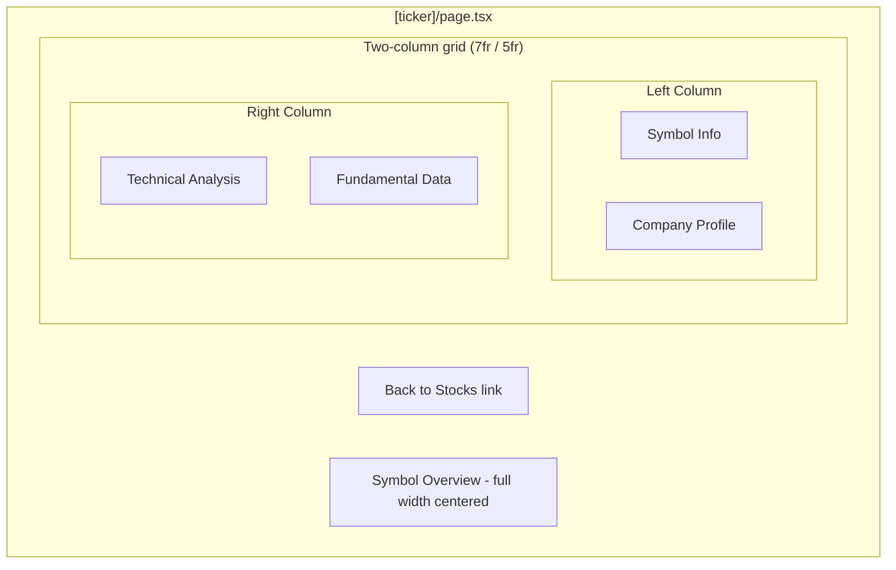

# Stock Detail Page - TradingView Widgets

## Layout

Both columns will share the same total height. The left column gets more horizontal space via a `grid-cols-12` split (7 left / 5 right).

## Files to Change

### 1. Extend `TradingViewWidget` with 5 new widget types

**[finance-dashboard/components/tradingview/TradingViewWidget.tsx](finance-dashboard/components/tradingview/TradingViewWidget.tsx)**

- Add 5 dynamic imports: `SymbolInfo`, `TechnicalAnalysis`, `FundamentalData`, `CompanyProfile`, `SymbolOverview`
- Extend the `TradingViewWidgetProps` discriminated union with 5 new branches using their respective prop types (`SymbolInfoProps`, `TechnicalAnalysisProps`, `FundamentalDataProps`, `CompanyProfileProps`, `SymbolOverviewProps`)
- Add render branches in the JSX for each new widget name

### 2. Add symbol-specific config factory functions

**[finance-dashboard/components/tradingview/widget-configs.ts](finance-dashboard/components/tradingview/widget-configs.ts)**

- Import the 5 new prop types from `react-ts-tradingview-widgets`
- Create factory functions that accept a `symbol: string` and return typed configs using the existing `tradingViewBaseConfig` spread:
  - `symbolInfoConfig(symbol)` -- returns `SymbolInfoProps`
  - `technicalAnalysisConfig(symbol)` -- returns `TechnicalAnalysisProps` with `interval: "1D"`, `showIntervalTabs: true`
  - `fundamentalDataConfig(symbol)` -- returns `FundamentalDataProps`
  - `companyProfileConfig(symbol)` -- returns `CompanyProfileProps`
  - `symbolOverviewConfig(symbol)` -- returns `SymbolOverviewProps` with `dateFormat: "dd MMM 'yy"`, `chartType: "area"`, `showVolume: true`

### 3. Create `StockDetailWidgets` client component

**New file: [finance-dashboard/components/tradingview/StockDetailWidgets.tsx](finance-dashboard/components/tradingview/StockDetailWidgets.tsx)**

- `"use client"` component receiving `symbol: string` as a prop
- Calls the 5 config factory functions with the symbol
- Renders the two-column + full-width layout using `TradingViewWidget`
- Uses Tailwind grid: `grid grid-cols-12 gap-6` for columns, left col `col-span-7`, right col `col-span-5`
- Both columns use `flex flex-col gap-6` internally so they stretch equally
- Symbol Overview below at full width

### 4. Update barrel export

**[finance-dashboard/components/tradingview/index.ts](finance-dashboard/components/tradingview/index.ts)**

- Export `StockDetailWidgets` and the new config factory functions

### 5. Update the `[ticker]` page

**[finance-dashboard/app/(main)/stocks/[ticker]/page.tsx](finance-dashboard/app/(main)/stocks/[ticker]/page.tsx)**

- Keep as a Server Component (extracts `ticker` from params)
- Replace the placeholder card with `<StockDetailWidgets symbol={symbol} />`
- Keep the "Back to Stocks" link at the top
- Add the TradingView disclaimer footer (matching the stocks page)
