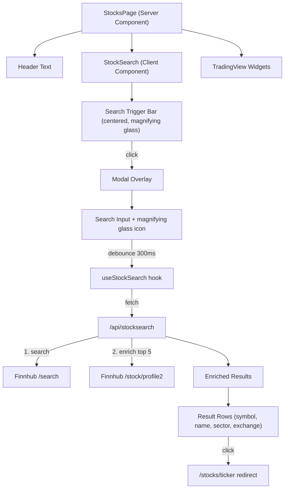

# Stock Search Feature

## Context

The stocks page (`[app/(main)/stocks/page.tsx](finance-dashboard/app/(main)`/stocks/page.tsx)) currently shows TradingView widgets (heatmap, overview, market, stories). We need to add a centered search bar below the header that opens a modal for searching stocks by ticker or company name. The existing `[ticker]` detail page will be simplified to just show the selected ticker, and unused API routes will be removed.

## Architecture

## New Files

### 1. API Route: `[app/api/stocksearch/route.ts](finance-dashboard/app/api/stocksearch/route.ts)`

- Accept `q` query parameter
- Call Finnhub `/api/v1/search?q={query}&token={key}`
- Take top 5 results, then enrich each in parallel via `/api/v1/stock/profile2` to get `exchange` and `finnhubIndustry` (sector)
- Return array: `{ symbol, displaySymbol, description, type, exchange, sector }`
- Finnhub search returns `symbol`, `displaySymbol`, `description`, `type` -- profile2 is needed for exchange/sector

### 2. Search Hook: `[components/stock-search/useStockSearch.ts](finance-dashboard/components/stock-search/useStockSearch.ts)`

- Manages `query`, `results`, `loading` state
- Implements 300ms debounce: on each keystroke, reset a timer; only fire the API call after 300ms of no typing
- Calls `/api/stocksearch?q={query}` when debounce fires
- Clears results when query is empty
- Returns `{ query, setQuery, results, loading }`

### 3. Search Component: `[components/stock-search/StockSearch.tsx](finance-dashboard/components/stock-search/StockSearch.tsx)`

**Trigger (always visible on page):**

- Centered below the header text, styled as a rounded pill/bar with a `Search` (magnifying glass) icon from `lucide-react` and placeholder text like "Search stocks..."
- Clicking opens the modal

**Modal:**

- Full-screen overlay with dark backdrop (`bg-black/60 backdrop-blur-sm`)
- Centered content panel using the existing `glass-strong` class for consistency
- Search input at top with magnifying glass icon, auto-focused
- Results list below input, each row showing (left-aligned):
  - **Stock Symbol** (`displaySymbol`, e.g. "AAPL") (bold) + **Company Name** (`description`)
  - **Sector** + **Exchange** (smaller, muted text)
- Clicking a row calls `router.push('/stocks/{ticker}')` via Next.js `useRouter`
- Close on backdrop click, Escape key, or X button
- Loading spinner while results are fetching

### 4. Barrel Export: `[components/stock-search/index.ts](finance-dashboard/components/stock-search/index.ts)`

- Export `StockSearch` component

## Modified Files

### 5. Stocks Page: `[app/(main)/stocks/page.tsx](finance-dashboard/app/(main)`/stocks/page.tsx)

- Import `StockSearch` from `@/components/stock-search`
- Insert `<StockSearch />` between the header `
` (lines 14-19) and the first `<section>` (line 21)
- The page remains a Server Component; `StockSearch` is a self-contained client component

### 6. Ticker Page: `[app/(main)/stocks/[ticker]/page.tsx](finance-dashboard/app/(main)`/stocks/[ticker]/page.tsx)

- Strip all existing code (503 lines of charts, stats, news -- all using soon-to-be-deleted API routes)
- Replace with a minimal page that displays the selected ticker prominently, matching the existing dark theme
- Include a back link to `/stocks`

## Deleted Files

### 7. Remove deprecated API routes

Since Finnhub is now only used for the search endpoint and the `[ticker]` page no longer fetches stock/chart/news data:

- Delete `[app/api/stock/route.ts](finance-dashboard/app/api/stock/route.ts)` -- was used by old `[ticker]` page
- Delete `[app/api/stockhistorical/route.ts](finance-dashboard/app/api/stockhistorical/route.ts)` -- was used by old `[ticker]` page (Yahoo Finance)
- Delete `[app/api/stocknews/route.ts](finance-dashboard/app/api/stocknews/route.ts)` -- was used by old `[ticker]` page
- Delete `[app/api/stockscreener/route.ts](finance-dashboard/app/api/stockscreener/route.ts)` -- not referenced anywhere in the app

## Design Notes

- **No shadcn/ui setup**: The `.cursorrules` prefers shadcn/ui, but the project has no shadcn infrastructure (`components/ui/` does not exist, no `@radix-ui`, `tailwind-merge`, or `clsx` installed). Rather than introducing the full shadcn pipeline for a single modal, the search component will be built manually using the existing design language (`glass`/`glass-strong` classes, slate color palette, lucide icons). This keeps the change focused and consistent. shadcn can be initialized as a separate effort when more UI primitives are needed.
- **Finnhub rate limits**: The free tier allows 60 calls/min. Each search costs 1 (search) + up to 5 (profile2 enrichment) = 6 calls. With 300ms debounce, this stays well within limits for typical usage.
- **Comments**: Per `.cursorrules`, only section-level comments and JSDoc on exported functions/hooks. No narration of obvious logic.

