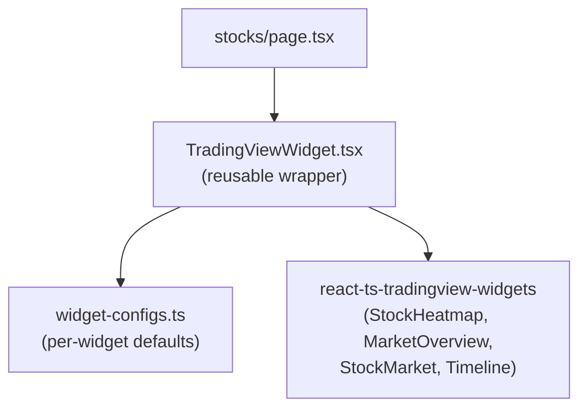

# TradingView Stocks Page Rebuild

## Context

The current [stocks/page.tsx](finance-dashboard/app/(main)/stocks/page.tsx) fetches live quotes for 12 tickers + gainers/losers from Finnhub, burning through the 60-req/min free-tier limit. We will replace this with four embedded TradingView widgets that provide the same market overview with zero API calls.

**Key discovery:** TradingView's "Top Stories" widget is the same as the library's `Timeline` component (TradingView renamed it). So all 4 widgets are available in the `react-ts-tradingview-widgets` npm package -- no custom iframe wrappers needed.

## Architecture

Per [.cursorrules](.cursorrules), feature-specific components go in `@/components/[feature-name]`. We will create a `components/tradingview/` directory with a config-driven pattern for reusability.




### Reusability pattern

Instead of separate component files per widget (which would each be trivial one-liners), we use a **shared wrapper + config map** approach:

- `**widget-configs.ts`** -- exports a base defaults object (`colorTheme: "dark"`, `autosize: true`, `isTransparent: true`, `locale: "en"`) and per-widget config objects that spread the base. Adding a new widget in the future means adding one config export.
- `**TradingViewWidget.tsx`** -- a `'use client'` wrapper that provides a consistently styled container (fixed or flexible height), handles the Next.js SSR boundary via `next/dynamic`, and wraps the library component. Accepts `children` (the actual widget) + `className`/`height` for layout control.
- `**index.ts`** -- barrel exports for clean imports.

## Page Layout

```
+--------------------------------------------------+
|              Stock Heatmap (full width)           |
|                   ~500px tall                     |
+--------------------------------------------------+
|  Market Overview  |  Stock Market  |  Top Stories |
|   (1/3 width)     |  (1/3 width)   | (1/3 width) |
|   ~500px tall      |  ~500px tall   | ~500px tall |
+--------------------------------------------------+
```

The page header will be simplified: a title ("Markets") with a back arrow to `/dashboard`. No search bar, refresh, or Finnhub-dependent features since TradingView widgets are self-contained.

## Files to Create

- `**finance-dashboard/components/tradingview/widget-configs.ts**` -- shared base defaults + 4 widget config exports: `stockHeatmapConfig`, `marketOverviewConfig`, `stockMarketConfig`, `topStoriesConfig`
- `**finance-dashboard/components/tradingview/TradingViewWidget.tsx**` -- generic client-side wrapper that renders a TradingView widget inside a styled container, using `next/dynamic` with `ssr: false` to avoid SSR hydration issues
- `**finance-dashboard/components/tradingview/index.ts**` -- barrel file

## Files to Modify

- `**finance-dashboard/app/(main)/stocks/page.tsx**` -- complete rewrite; remove all Finnhub fetch logic, QuoteCard, MoverRow, skeletons, and replace with widget layout

## Unchanged

- `**finance-dashboard/app/(main)/stocks/[ticker]/page.tsx**` -- the individual stock detail page is not affected by this change; it uses separate API routes and serves a different purpose

## Install

```bash
npm i react-ts-tradingview-widgets
```

## Widget Config Details (dark mode)

All widgets will use these shared defaults:

- `colorTheme: "dark"`
- `isTransparent: true` (blends with the dark page background)
- `autosize: true` (fills container width/height)
- `locale: "en"`

Widget-specific settings:

- **StockHeatmap**: `dataSource: "SPX500"`, `blockSize: "market_cap_basic"`, `blockColor: "change"`, `hasTopBar: true`
- **MarketOverview**: `showChart: true`, `dateRange: "12M"`, `showSymbolLogo: true` (default tabs: Indices, Commodities, Bonds, Forex)
- **StockMarket**: `exchange: "US"`, `showChart: true`, `dateRange: "12M"`, `showSymbolLogo: true`
- **Timeline (Top Stories)**: `feedMode: "market"`, `market: "stock"`, `displayMode: "regular"`

